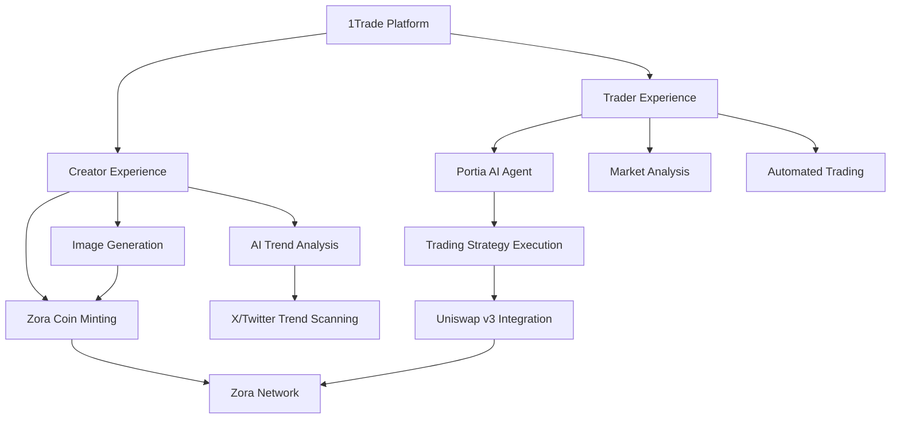
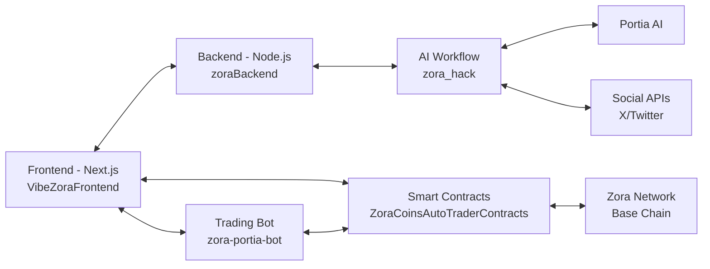
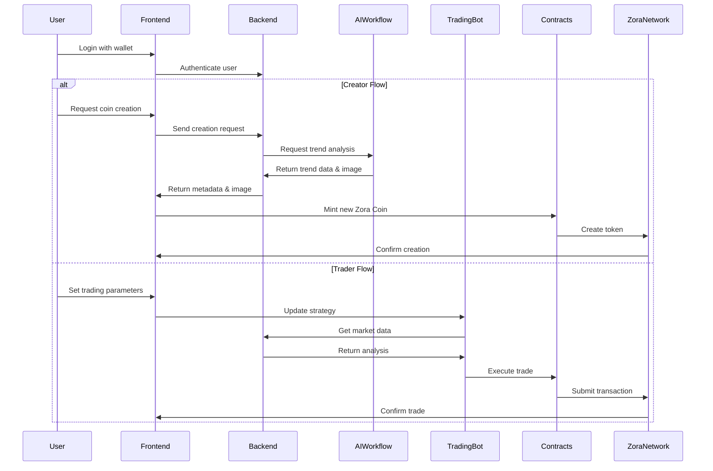
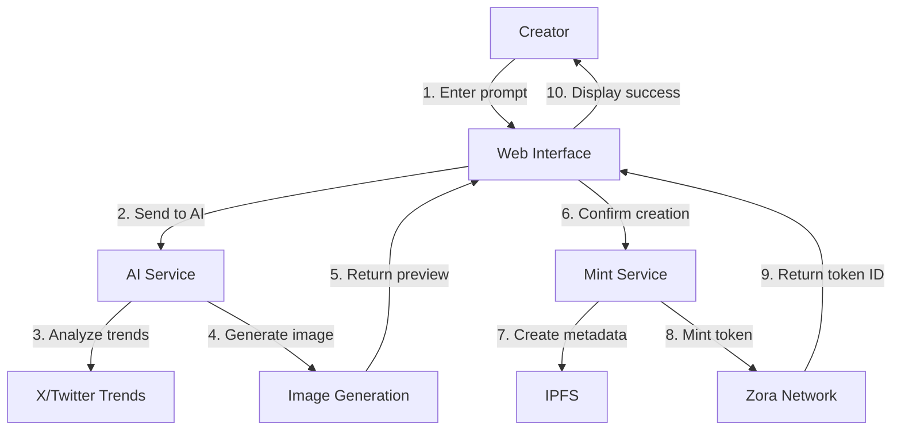
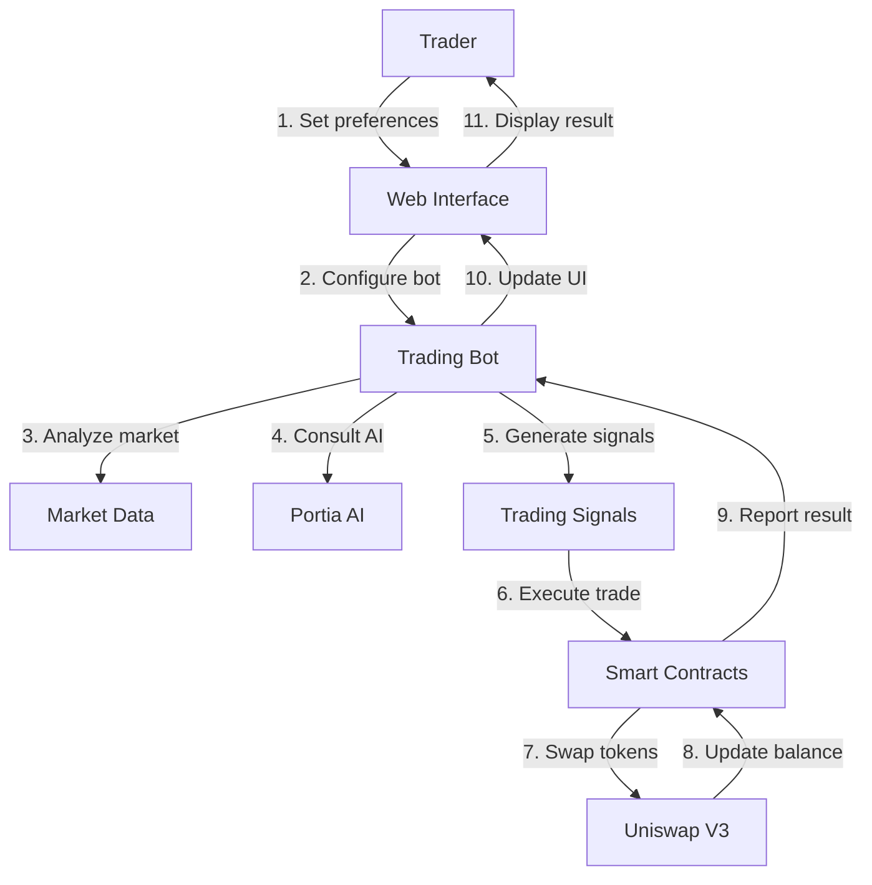

# 1Trade - AI-powered Web3 Trading Platform

We’re building an AI-powered Web3 DApp that combines the strengths of Zora and Portia AI to create a dual experience: one for creators, and one for traders.

On the creator side, we’ll use AI to scan what’s trending on X — specific hashtags, topics, or even individual profiles like Elon or Trump. Based on user inputs (like frequency, content style, and theme preferences), the app will automatically generate an image related to that trend, and mint it as a Zora Coin using their protocol on Base. So basically, creators can auto-generate and launch their own trend-driven coins without touching a line of code.

On the trader side, we’ll have a Portia-powered AI agent that tracks market and social trends in real time, finds relevant Zora Coins, and evaluates their trading potential based on a user’s defined risk profile. The agent can then suggest trades or even execute them directly via Uniswap v3, depending on the user’s preferences.

The real power here is in combining cultural relevance with automated onchain execution — we’re turning trends into tokens and making trading decisions smarter through AI.

## 🌐 Links

- [Demo](https://vibe-zora-frontend-dkwa.vercel.app/)
- [Frontend Repository](https://github.com/gabikreal1/VibeZoraFrontend)
- [Trading Bot Repository](https://github.com/devanshkaria88/zora-portia-bot)
- [Smart Contracts Repository](https://github.com/gabikreal1/ZoraCoinsAutoTraderContracts)

## 🚀 Overview

1Trade combines cultural relevance with automated onchain execution — turning trends into tokens and making trading decisions smarter through AI. It consists of multiple components working together:



## 🏗️ Architecture

The system consists of several interconnected components:



## 📊 Components

### 1. VibeZoraFrontend
Next.js web application that provides the user interface for both creators and traders.

**Key Features:**
- User wallet connection
- Coin creation workflow
- Trading interface
- AI prompt generation
- Image visualization and preview

### 2. ZoraBackend
Node.js backend built with TypeScript using the MVC architecture pattern.

**Key Features:**
- User management via wallet addresses
- API endpoints for creators and traders
- Integration with AI services
- MongoDB database for persistent storage

### 3. Zora-Portia-Bot
Python-based trading bot that integrates with Zora Network and Portia AI.

**Key Features:**
- Real-time market analysis
- Technical indicators (RSI, MACD)
- Portia AI integration for enhanced trading
- Automated trading signals with confidence scoring

### 4. ZoraCoinsAutoTraderContracts
Smart contract system for executing trades on Uniswap V3.

**Key Features:**
- Multi-user support with balance tracking
- Price threshold-based trading
- Integration with Uniswap V3 for token swaps
- AI agent interface for automated trading

### 5. Zora_Hack
Flask-based AI workflow for image generation and trend analysis.

**Key Features:**
- X/Twitter trend analysis
- AI-powered image generation
- Meme creation based on trending topics
- Integration with Google's Vertex AI

## 🔄 Data Flow



## 🛠️ Technologies Used

- **Frontend**: Next.js, React, TypeScript, Tailwind CSS
- **Backend**: Node.js, Express, MongoDB, TypeScript
- **AI**: Portia AI, Google Vertex AI, NLP for trend analysis
- **Blockchain**: Solidity, Hardhat, Ethers.js, Zora Protocol SDK
- **Trading**: Technical analysis libraries, Uniswap V3 SDK
- **Infrastructure**: Python, Flask, GraphQL

## 🔮 Future Plans

1. **End-to-End Integration**
   - Fully integrate the 1Trade bot with the web platform
   - Complete the AI workflow for seamless content generation

2. **Enhanced AI Capabilities**
   - Improve trend detection accuracy
   - Develop more sophisticated trading strategies
   - Optimize image generation for coin creation

3. **Multi-Chain Support**
   - Expand beyond Zora Network
   - Support additional L2 solutions
   - Cross-chain trading opportunities

4. **Community Features**
   - Social trading capabilities
   - Creator dashboards
   - Performance analytics

---

## 🔍 Detailed Component Overview

### Creator Flow



### Trader Flow



## 📦 Installation & Setup

Each component has its own setup process. Please refer to the individual README files for detailed instructions.

1. **VibeZoraFrontend**
   ```bash
   cd VibeZoraFrontend
   npm install
   npm run dev
   ```

2. **ZoraBackend**
   ```bash
   cd zoraBackend
   npm install
   npm run dev
   ```

3. **Zora-Portia-Bot**
   ```bash
   cd zora-portia-bot
   pip install -r requirements.txt
   python run_bot.py
   ```

4. **Smart Contracts**
   ```bash
   cd ZoraCoinsAutoTraderContracts
   npm install
   npx hardhat compile
   npx hardhat run scripts/deploy.js --network zora
   ```

5. **AI Workflow**
   ```bash
   cd zora_hack
   pip install -r requirements.txt
   python flask_app.py
   ```

## 🧪 Testing

Each component includes its own testing framework. Run tests for each component separately.

## 🤝 Contributing

Contributions are welcome! Please feel free to submit a Pull Request.

## 📄 License

This project is licensed under the MIT License.
